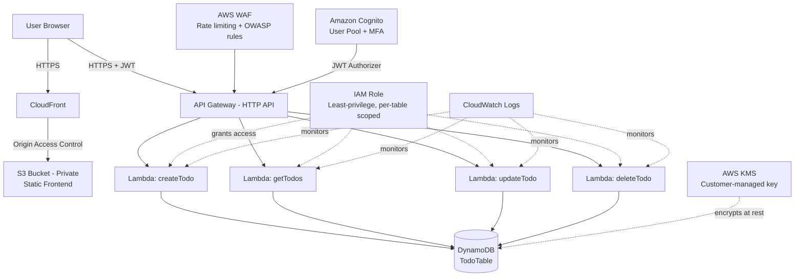

# SEC//TASKS — Serverless Security Operations & Incident Console

A production-ready, highly secure **Zero-Trust Serverless Task and Incident Management Console** designed for security teams to log, track, and remediate operational tasks and vulnerabilities by severity. The system relies entirely on managed AWS microservices — no traditional servers to provision, patch, or manage.

🌐 **[Live Demo Application](https://d1u1vfbs03w6e1.cloudfront.net)**

---

## Contents

- [Security Architecture & Hardening](#-security-architecture--hardening)
- [System Topology & Data Flow](#️-system-topology--data-flow)
- [Tech Stack](#️-tech-stack)
- [Repository Structure](#-repository-structure)
- [Architectural & Deployment Evidence](#-architectural--deployment-evidence-audit-logs)
- [API Reference](#-api-reference)
- [Deployment Summary](#️-deployment-summary)
- [Challenges & Troubleshooting](#-challenges--troubleshooting)
- [Future Roadmap](#-future-roadmap)
- [Author](#-author)

---

## 🔒 Security Architecture & Hardening

This project was built with a **security-first** mindset, integrating standard industry practices to ensure data integrity and least-privilege access at every layer:

- **Zero-Trust Authentication:** Integrated with **Amazon Cognito** using JWT (JSON Web Token) identity tokens, with **mandatory MFA (TOTP)**, to strictly secure every API endpoint.
- **API Gateway & Cognito Authorizer:** All backend routes are locked behind a native Cognito JWT Authorizer on API Gateway. Unauthenticated requests are rejected with `401 Unauthorized` at the gateway itself and never reach application code.
- **IAM Least-Privilege Policies:** The Lambda execution role is scoped strictly to the specific DynamoDB table ARN and KMS key ARN, with explicit action allowances only (`dynamodb:Scan`, `PutItem`, `UpdateItem`, `DeleteItem`; `kms:Decrypt`, `Encrypt`, `GenerateDataKey`) — no wildcard permissions anywhere.
- **Encryption at Rest:** DynamoDB is encrypted with a **customer-managed AWS KMS key**, not the AWS-owned default, giving full control over key policy and lifecycle.
- **Data Isolation (Anti-IDOR):** Every database operation is scoped server-side to the `sub` claim extracted from the caller's verified JWT (`event.requestContext.authorizer.jwt.claims.sub`) — never from client-supplied input. This makes it structurally impossible for one user to read or modify another user's records.
- **Secure Static Hosting via HTTPS:** The frontend is hosted on a fully **private S3 bucket** (Block Public Access: ON), exposed exclusively through **Amazon CloudFront** via **Origin Access Control (OAC)**, so the bucket itself has zero public attack surface.
- **Strict CORS Enforcement:** CORS on the API is explicitly restricted to the production CloudFront domain only — no wildcard origin.
- **Edge Protection:** The API is guarded by **AWS WAF**, running AWS Managed Rules (OWASP Core Rule Set) plus a rate-based rule blocking any source IP exceeding 100 requests / 5 minutes.
- **Cost Guardrails:** An AWS Budget alert notifies by email if projected spend crosses a defined threshold, preventing unnoticed charges during development.

---
## Architecture



## 🗺️ System Topology & Data Flow

The diagram below is the verified, corrected architecture matching the actual deployment — a purely serverless design with **no VPC, no EC2, no self-managed servers**; every component is a regional managed AWS endpoint.

<p align="center">
  
</p>

**Request flow:** the browser loads the static app from CloudFront/S3, authenticates against Cognito (email + password + MFA) to obtain a JWT, then calls API Gateway with that token attached as a Bearer header. Every request first passes through AWS WAF, then through the Cognito JWT Authorizer at the gateway, before ever reaching a Lambda function. Each Lambda function operates under one shared, least-privilege IAM role and reads/writes only the DynamoDB records owned by the authenticated caller.

---

## 🛠️ Tech Stack

| Category | Service / Technology |
| :--- | :--- |
| **Compute** | AWS Lambda — Node.js 24 (ES Modules) |
| **API Layer** | Amazon API Gateway (HTTP API) |
| **Auth & Identity** | Amazon Cognito (User Pools, JWT, MFA enforced) |
| **Database** | Amazon DynamoDB (on-demand capacity, NoSQL) |
| **Data Protection** | AWS KMS (customer-managed symmetric key) |
| **Edge Security** | AWS WAF (Web Application Firewall) |
| **Frontend Hosting** | Amazon S3 (fully private) + Amazon CloudFront |
| **Monitoring** | Amazon CloudWatch (Logs & Metrics) |
| **Cost Control** | AWS Budgets |
| **Frontend UI** | HTML5, Tailwind CSS, vanilla JavaScript (ES6+), Font Awesome |
| **Region** | eu-north-1 (Stockholm) |

---

## 📁 Repository Structure

```text
sec-tasks/
├── README.md                     # System architecture & documentation
├── frontend/
│   └── index.html                # Zero-trust frontend client console (SPA)
├── backend/                       # Serverless functions (AWS Lambda)
│   ├── createTodo.mjs            # Creates a new secure task ticket (POST)
│   ├── getTodos.mjs              # Returns user-scoped records (GET)
│   ├── updateTodo.mjs            # Updates status/severity/title (PUT)
│   └── deleteTodo.mjs            # Deletes a target ticket (DELETE)
└── screenshots/                   # Architecture diagram + deployment evidence
    ├── sec-tasks-architecture.png
    └── 01-...29-*.png             # 29 annotated console screenshots
```

---

## 📸 Architectural & Deployment Evidence (Audit Logs)

> ⚠️ **OpSec note:** all AWS Account IDs and sensitive identifiers are redacted or cropped out of every screenshot before being committed to version control.

### 1. Identity & Access Control — Cognito & IAM
Verification of secure user provisioning, mandatory MFA (TOTP), and a least-privilege IAM execution policy scoped directly to the DynamoDB table ARN and KMS key ARN.

### 2. Data Persistence Layer — DynamoDB & KMS
NoSQL table design with a composite primary key (`userId` hash + `todoId` range), and server-side encryption managed via a customer-managed AWS KMS key.

### 3. Serverless Compute & Orchestration — Lambda & API Gateway
Isolated Lambda functions running the Node.js 24 (ES Modules) runtime, secured end-to-end by a Cognito JWT Authorizer with strict, origin-restricted CORS.

### 4. Edge Layer Security & Perimeter Defense — WAF, S3 & CloudFront
Verification that the S3 origin is fully private with public access blocked, reachable only through CloudFront via Origin Access Control, with HTTPS enforced and AWS WAF Managed Rules active on the API.

### 5. Running Application — Live UI/UX
The end-user console styled as a security operations dashboard, supporting client-side severity filtering, status filtering, free-text search, and overdue-task highlighting.

### 6. Verification Testing & Cost Management
Postman evidence of endpoint enforcement (rejected unauthenticated requests vs. successful authenticated requests) alongside the configured AWS Budgets cost alert.

*(Screenshots are numbered 01–29 in the `/screenshots` folder, grouped by the six categories above.)*

---

## 📡 API Reference

All routes require `Authorization: Bearer <Cognito ID token>` in the request headers.

| Method | Path | Description | Request Body |
| --- | --- | --- | --- |
| **POST** | `/todos` | Create a new task/ticket | `{ "title": string, "severity"?: "low"\|"medium"\|"high"\|"critical", "dueDate"?: "YYYY-MM-DD" }` |
| **GET** | `/todos` | List all tasks for the authenticated user | *None* |
| **PUT** | `/todos/{id}` | Update a task (partial update) | `{ "title"?, "completed"?, "severity"?, "dueDate"? }` |
| **DELETE** | `/todos/{id}` | Delete a task | *None* |

`userId` is never read from the client — it is always derived server-side from the verified JWT, closing off any possibility of one user acting on another user's data (IDOR prevention).

---

## 🛠️ Deployment Summary

This infrastructure was deployed manually through the AWS Console, deliberately, to build a deep working understanding of each service before considering automation:

1. **DynamoDB** — created `TodoTable` with `userId` (partition key) and `todoId` (sort key); enabled encryption with a customer-managed KMS key.
2. **IAM** — provisioned `TodoLambdaExecutionRole`, scoped strictly to the table ARN and KMS key ARN (least privilege).
3. **Lambda** — deployed the four functions (`createTodo`, `getTodos`, `updateTodo`, `deleteTodo`) as ES modules on the Node.js 24 runtime, sharing the least-privilege role.
4. **Cognito** — created a User Pool with email sign-in, enforced password policy, and mandatory TOTP-based MFA; app client configured with no client secret (browser-safe).
5. **API Gateway** — created an HTTP API, mapped each route to its Lambda via proxy integration, and attached the native Cognito JWT Authorizer to every route.
6. **WAF** — created a Web ACL with AWS Managed Rules (Core Rule Set) and a rate-based rule, associated directly with the API Gateway.
7. **S3 & CloudFront** — blocked all public access on the S3 bucket, connected CloudFront via Origin Access Control (OAC), and enforced HTTPS.
8. **CORS** — locked `Access-Control-Allow-Origin` on the API down to the CloudFront production domain only.
9. **Budgets** — configured a monthly cost threshold alert to guard against unexpected charges.

---

## 🧩 Challenges & Troubleshooting

Real deployments rarely work on the first attempt — documenting what broke and how it was diagnosed is part of the engineering record:

- **Table name mismatch:** Lambda functions initially referenced a table name that didn't match the deployed DynamoDB table, producing `ResourceNotFoundException` on every request. Diagnosed directly from CloudWatch Logs and fixed by correcting the `TABLE_NAME` constant.
- **IAM permission gaps:** After the table name fix, writes and deletes still failed with `AccessDeniedException`. CloudWatch Logs named the exact missing action and resource ARN, making the fix (updating the inline IAM policy) immediate.
- **ES Module syntax errors:** Some functions initially mixed CommonJS `require()` with a Node.js runtime configured for ES Modules, causing a `ReferenceError` at cold start. Standardized all functions on `import`/`export` syntax.
- **CORS during local development:** Opening `index.html` directly from the filesystem (`file://`) triggered browser CORS rejections. Serving the frontend through a local dev server resolved preflight handling during development, ahead of locking CORS to the production CloudFront origin.

---

## 🔮 Future Roadmap

- [ ] Migrate the manually-configured infrastructure to Infrastructure as Code (AWS SAM or CloudFormation) for repeatable, one-command deployment.
- [ ] Implement an automated CI/CD pipeline (GitHub Actions) for Lambda deployment on push.
- [ ] Attach a WAF Web ACL to the CloudFront distribution in addition to the API, for defense in depth on the frontend.
- [ ] Add automated unit and integration tests for each Lambda function.
- [ ] Introduce DynamoDB Streams to trigger notifications (via SNS) when a critical-severity task is created.

---
## Screenshots

All screenshots live in [`/screenshots`](./screenshots), organized by architecture layer. Account IDs and other identifiers are redacted where relevant.

### Identity & Access — Cognito + IAM

| | |
|---|---|
|  |  |
| User Pool configuration (email sign-in) | MFA set to **Required** |
|  |  |
| App client with no client secret (SPA best practice) | `TodoLambdaExecutionRole` attached policies |
|  | |
| Inline policy scoped to a single table ARN — least privilege in practice | |

### Data Layer — DynamoDB + KMS

| | |
|---|---|
|  |  |
| `TodoTable` — partition key `userId`, sort key `todoId` | Encryption at rest via customer-managed key, not the AWS default |
|  |  |
| `TodoProjectKey` (symmetric CMK) | Item Explorer with sample task records |

### Compute — Lambda

| | |
|---|---|
|  |  |
| The four functions: create / get / update / delete | Function source (`createTodo`) |
|  | |
| Successful invocation trace in CloudWatch Logs | |

### API Gateway

| | |
|---|---|
|  |  |
| GET/POST/PUT/DELETE routes | Cognito JWT Authorizer attached to every route |
|  | |
| CORS restricted to the CloudFront origin, not `*` | |

### Edge Security — AWS WAF

| | |
|---|---|
|  |  |
| Managed Core Rule Set + rate-based rule | Web ACL associated with the API Gateway |
|  | |
| Blocked/allowed request metrics | |

### Frontend Hosting — S3 + CloudFront

| | |
|---|---|
|  |  |
| Bucket fully private — Block Public Access ON | Bucket policy scoped to the CloudFront distribution only |
|  |  |
| Distribution status: Enabled | HTTP → HTTPS redirect enforced |

### The App in Action

| | |
|---|---|
|  |  |
| Cognito-backed login | Tasks color-coded by severity (Critical/High/Medium/Low) |
|  |  |
| Add/edit ticket form | Status + severity filters applied |

### Security Testing

| | |
|---|---|
|  |  |
| Request without a JWT rejected with `401 Unauthorized` | Authenticated request succeeds with `201 Created` |
|  | |
| Cost guardrail — budget alert configured to avoid surprise charges | |

---

## 👨‍💻 Author

**Muhammed Mustafa Gomaa**

Network Security Engineer ·
Focused on secure cloud infrastructure, serverless architectures, and zero-trust design principles.
