# 🛡️ SEC//TASKS
### Secure Serverless Task & Incident Management System
---
<p align="center">
    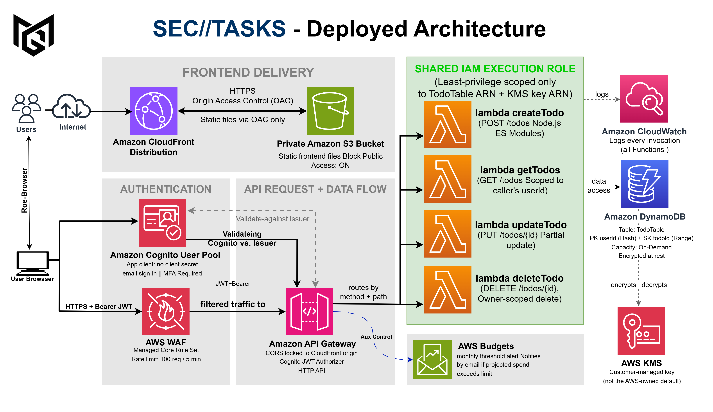
</p>

---

<p align="center">

[](https://d1u1vfbs03w6e1.cloudfront.net)    

</p>

---

A production-grade **Zero-Trust Serverless Security Operations Console** built entirely on Amazon Web Services (AWS).

SEC//TASKS is a security-focused cloud application that demonstrates how modern AWS managed services can be combined to build a highly secure, scalable, and production-inspired serverless system without provisioning or managing any traditional servers.

Unlike a typical CRUD project, this application was intentionally engineered using **Security-by-Design**, **Defense-in-Depth**, and **Zero Trust** principles from the very beginning.

---

🌐 **Live Demo**

https://d1u1vfbs03w6e1.cloudfront.net

---

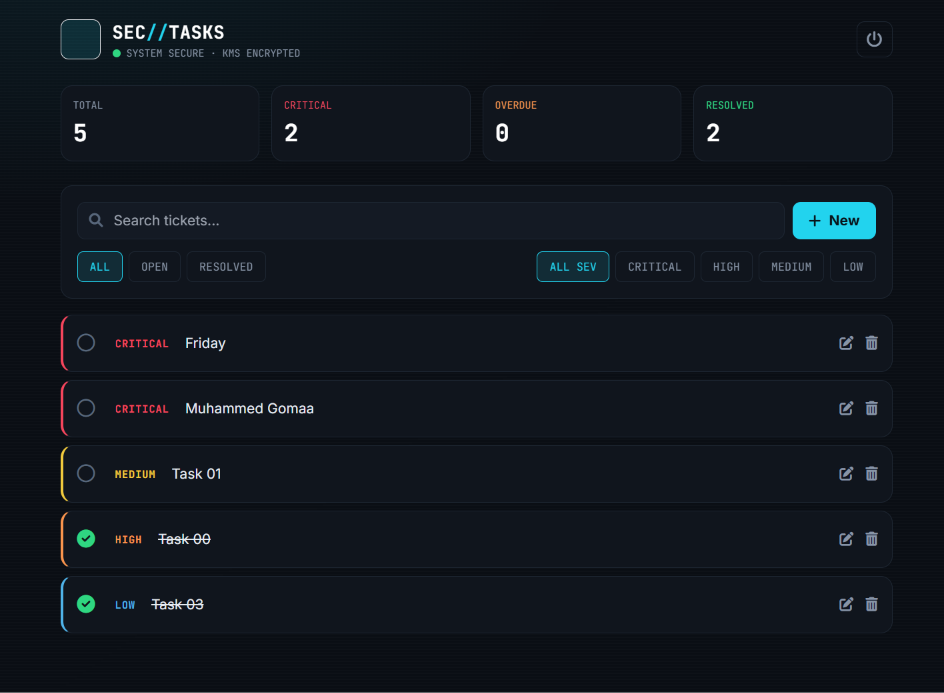

---

# 📚 Table of Contents

- [Why This Project](#-why-this-project)
- [Features](#-features)
- [Design Principles](#-design-principles)
- [Threat Model](#-threat-model)
- [Security Controls Matrix](#-security-controls-matrix)
- [Security Architecture & Hardening](#-security-architecture--hardening)
- [Architecture Overview](#-architecture-overview)
- [System Topology & Data Flow](#-system-topology--data-flow)
- [Tech Stack](#-tech-stack)
- [Repository Structure](#-repository-structure)
- [Deployment Evidence](#-architectural--deployment-evidence-audit-logs)
- [API Reference](#-api-reference)
- [Deployment Summary](#-deployment-summary)
- [Challenges & Troubleshooting](#-challenges--troubleshooting)
- [Lessons Learned](#-lessons-learned)
- [Future Roadmap](#-future-roadmap)
- [Screenshots](#-screenshots)
- [Skills Demonstrated](#-skills-demonstrated)
- [Author](#-author)

---

# 🎯 Why This Project

Cloud projects often demonstrate functionality but overlook security.

SEC//TASKS was deliberately built as a **Cloud Security Engineering portfolio project**, where every architectural decision prioritizes security before convenience.

Instead of creating another basic CRUD application, the objective was to implement real-world AWS security controls that closely resemble production environments.

This project demonstrates practical implementation of:

- Zero Trust Architecture
- Security by Design
- Defense in Depth
- Least Privilege Access Control
- Identity-First Authentication
- Secure Serverless Computing
- Private Cloud Storage
- Managed Cloud Security Services

The result is a fully functional serverless application that showcases both software engineering and cloud security engineering skills.

---

# ✨ Features

### Security

- 🔐 Amazon Cognito Authentication
- 🔑 Mandatory Multi-Factor Authentication (TOTP)
- 🛡 JWT Protected REST API
- 🚫 Unauthorized requests blocked before Lambda execution
- 🔒 Customer-managed AWS KMS encryption
- 👤 User data isolation (IDOR prevention)
- 🔥 AWS WAF protection
- 🚧 Rate limiting
- 🔐 HTTPS enforced
- ☁️ Private S3 bucket
- 🌍 CloudFront Origin Access Control (OAC)
- 📜 CloudWatch logging
- 💰 AWS Budget cost guardrails

### Application

- Create security tasks
- Update existing tasks
- Delete tasks
- Severity-based tickets
- Due-date tracking
- Search
- Filtering
- Responsive dashboard
- Modern SOC-inspired interface

---

# 🏗️ Design Principles

The architecture follows several modern cloud security principles.

| Principle | Implementation |
|------------|----------------|
| Security by Design | Security integrated into every architectural layer |
| Zero Trust | Every request must be authenticated and authorized |
| Defense in Depth | Multiple independent security layers |
| Least Privilege | Minimal IAM permissions |
| Managed Services First | AWS managed services whenever possible |
| Stateless Computing | AWS Lambda functions |
| Event-Driven Architecture | API Gateway triggers Lambda |
| Encryption Everywhere | KMS-managed encryption at rest |
| Identity First | Cognito controls access to every API endpoint |

---

# 🎯 Threat Model

The architecture was designed to mitigate common cloud and web security threats.

| Threat | Mitigation |
|---------|------------|
| Unauthorized API Access | Cognito JWT Authorizer |
| Credential Theft | Mandatory MFA |
| Broken Authentication | Cognito User Pools |
| IDOR | JWT ownership validation |
| Data Exposure | Customer-managed AWS KMS |
| Privilege Escalation | Least-Privilege IAM |
| SQL Injection | AWS Managed WAF Rules |
| Cross-Site Scripting (XSS) | AWS Managed WAF Rules |
| Brute Force | WAF Rate Limiting |
| Public Bucket Exposure | Private S3 + OAC |
| Man-in-the-Middle | HTTPS enforced |
| Resource Abuse | AWS Budgets |

---

# 🛡 Security Controls Matrix

| Layer | AWS Service | Security Control |
|--------|-------------|------------------|
| Identity | Amazon Cognito | MFA + JWT Authentication |
| Authentication | JWT | Verified Identity Tokens |
| Authorization | API Gateway | Cognito JWT Authorizer |
| Compute | AWS Lambda | Stateless execution |
| Database | DynamoDB | User-scoped access |
| Encryption | AWS KMS | Customer-managed encryption keys |
| Access Control | IAM | Least Privilege Policies |
| Edge | AWS WAF | Managed Rules + Rate Limiting |
| CDN | CloudFront | HTTPS + OAC |
| Storage | Amazon S3 | Private Bucket |
| Monitoring | CloudWatch | Logs & Metrics |
| Cost Protection | AWS Budgets | Spending Alerts |

---

# 🔒 Security Architecture & Hardening

Security is the foundation of this project—not an afterthought.

Every AWS service was selected and configured to enforce identity verification, minimize privileges, protect data, and reduce the application's attack surface.

### Identity & Authentication

- Amazon Cognito User Pool
- Email-based authentication
- Mandatory MFA (TOTP)
- JWT Identity Tokens
- Password policy enforcement

### Authorization

- Native Cognito JWT Authorizer
- Protected API Gateway routes
- Unauthorized requests rejected with **401 Unauthorized**
- Lambda functions never execute unless authentication succeeds

### Least Privilege IAM

Lambda executes using a tightly scoped IAM role that only allows the minimum permissions required.

Allowed DynamoDB actions include:

- GetItem
- PutItem
- UpdateItem
- DeleteItem
- Query
- Scan

Permissions are explicitly restricted to the project's DynamoDB table and KMS key.

No wildcard resource permissions are granted.

### Encryption

- Customer-managed AWS KMS Key
- DynamoDB encryption at rest
- Controlled key lifecycle
- Explicit KMS permissions

### Data Isolation

Every request derives the authenticated user's identity directly from:

```

event.requestContext.authorizer.jwt.claims.sub

```

The backend never trusts any user identifier provided by the client.

This completely prevents **Insecure Direct Object Reference (IDOR)** attacks by ensuring users can only access their own records.

### Secure Frontend Hosting

- Private Amazon S3 Bucket
- Block Public Access enabled
- CloudFront Origin Access Control
- HTTPS enforced

The S3 bucket is never publicly accessible.

### Edge Protection

AWS WAF protects the API using:

- AWS Managed Core Rule Set
- Rate-based protection
- OWASP attack mitigation

### Cost Protection

AWS Budgets continuously monitor project spending and notify administrators when predefined thresholds are exceeded.

---

# 🏛 Architecture Overview

The application follows a fully managed, event-driven serverless architecture.

There are:

- ❌ No EC2 instances
- ❌ No virtual machines
- ❌ No servers to patch
- ❌ No operating systems to manage

Instead, every request traverses multiple independent security layers before reaching the application logic.

```

                 User Browser
                      │
                 HTTPS Request
                      │
                 AWS CloudFront
                      │
        Origin Access Control (OAC)
                      │
          Private Amazon S3 Bucket

                      │

      JWT Authenticated API Request

                      │

                 AWS WAF

                      │

              API Gateway (HTTP API)

                      │

          Cognito JWT Authorizer

                      │

                AWS Lambda

                      │

               Amazon DynamoDB

                      │

             Customer-managed KMS

```

## Architecture Diagram

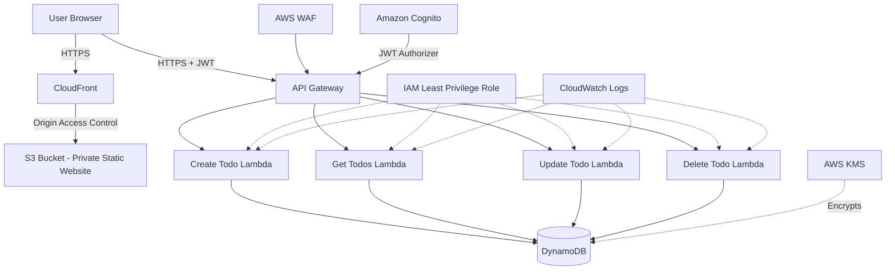
```mermaid
flowchart TD
    U[User Browser] -->|HTTPS| CF[CloudFront]
    CF -->|Origin Access Control| S3[S3 Bucket - Private Static Website]

    U -->|HTTPS + JWT| APIGW[API Gateway]

    WAF[AWS WAF] --> APIGW

    Cognito[Amazon Cognito] -->|JWT Authorizer| APIGW

    APIGW --> Create[Create Todo Lambda]
    APIGW --> Read[Get Todos Lambda]
    APIGW --> Update[Update Todo Lambda]
    APIGW --> Delete[Delete Todo Lambda]

    Create --> DynamoDB[(DynamoDB)]
    Read --> DynamoDB
    Update --> DynamoDB
    Delete --> DynamoDB

    KMS[AWS KMS] -. Encrypts .-> DynamoDB

    IAM[IAM Least Privilege Role] -.-> Create
    IAM -.-> Read
    IAM -.-> Update
    IAM -.-> Delete

    CloudWatch[CloudWatch Logs] -.-> Create
    CloudWatch -.-> Read
    CloudWatch -.-> Update
    CloudWatch -.-> Delete
```

# 🗺️ System Topology & Data Flow

The deployed architecture follows a fully managed, regional AWS serverless design.

Every request passes through multiple independent security controls before reaching any business logic. Identity verification, authorization, edge protection, encryption, and least-privilege access are enforced by managed AWS services, significantly reducing the application's attack surface.

<p align="center">
    
</p>

---

## End-to-End Request Flow

### 1. Static Application Delivery

The user accesses the application through Amazon CloudFront.

CloudFront securely retrieves the static frontend from a completely private Amazon S3 bucket using **Origin Access Control (OAC)**.

The bucket itself is never publicly accessible.

↓

### 2. User Authentication

The user signs in using Amazon Cognito.

Authentication requires:

- Email
- Password
- Multi-Factor Authentication (TOTP)

Upon successful authentication, Cognito issues a signed JWT Identity Token.

↓

### 3. Secure API Request

Every API request includes:

```
Authorization: Bearer <JWT Token>
```

The frontend never sends any user identifier manually.

↓

### 4. Edge Protection

Before reaching the API, every request is inspected by AWS WAF.

Protection includes:

- AWS Managed Core Rule Set
- Rate-based protection
- Common web exploit detection
- Malicious request filtering

↓

### 5. Authentication & Authorization

API Gateway validates the JWT against the Cognito User Pool.

Invalid requests are rejected immediately with:

```
401 Unauthorized
```

No Lambda function executes unless authentication succeeds.

↓

### 6. Business Logic

API Gateway invokes the corresponding Lambda function.

Each Lambda function:

- validates input
- extracts the authenticated user ID
- processes the request
- accesses DynamoDB

↓

### 7. Data Access

The authenticated identity is extracted directly from

```javascript
event.requestContext.authorizer.jwt.claims.sub
```

The backend never trusts user identifiers supplied by clients.

Every database operation is automatically scoped to the authenticated user.

↓

### 8. Secure Storage

Amazon DynamoDB stores task records.

The table uses:

- Partition Key → userId
- Sort Key → todoId

Encryption at rest is handled transparently using a customer-managed AWS KMS key.

↓

### 9. Monitoring

Every invocation generates CloudWatch logs containing:

- execution duration
- request metadata
- exceptions
- performance metrics

This provides complete observability without exposing sensitive application data.

---

# 🛠 Tech Stack

| Category | Technology |
|-----------|------------|
| Cloud Provider | Amazon Web Services |
| Compute | AWS Lambda |
| Runtime | Node.js 24 (ES Modules) |
| API Layer | Amazon API Gateway (HTTP API) |
| Authentication | Amazon Cognito |
| Authorization | JWT Authorizer |
| Database | Amazon DynamoDB |
| Encryption | AWS KMS |
| Edge Protection | AWS WAF |
| CDN | Amazon CloudFront |
| Frontend Hosting | Amazon S3 (Private) |
| Monitoring | Amazon CloudWatch |
| Cost Control | AWS Budgets |
| Frontend | HTML5 |
| Styling | Tailwind CSS |
| Icons | Font Awesome |
| Language | Vanilla JavaScript (ES6+) |
| Region | eu-north-1 (Stockholm) |

---

# 📁 Repository Structure

```text
SEC-TASKS
│
├── README.md
│
├── frontend
│   └── index.html
│
├── backend
│   ├── createTodo.mjs
│   ├── getTodos.mjs
│   ├── updateTodo.mjs
│   └── deleteTodo.mjs
│
└── screenshots
    ├── sec-tasks-architecture.png
    ├── 01-cognito-userpool-overview.png
    ├── ...
    └── 29-budget-alert-config.png
```

---

## Repository Overview

### frontend/

Contains the complete Single Page Application (SPA).

Responsibilities include:

- User authentication
- JWT management
- API communication
- Dashboard rendering
- Search
- Filtering
- Task management

---

### backend/

Contains four independent AWS Lambda functions.

Each function follows the Single Responsibility Principle.

| Function | Responsibility |
|-----------|---------------|
| createTodo | Create new security task |
| getTodos | Retrieve authenticated user's tasks |
| updateTodo | Update existing task |
| deleteTodo | Remove task |

---

### screenshots/

Contains deployment evidence documenting the complete AWS infrastructure.

Screenshots are grouped by architectural layer to support the accompanying documentation.

Sensitive information such as Account IDs has been redacted before publication.

---

# 📸 Architectural & Deployment Evidence (Audit Trail)

The repository includes a complete visual record of the deployed AWS environment.

Unlike many portfolio projects, every security control shown in this README is backed by actual deployment screenshots.

The screenshots are organized into six categories.

---

## 1. Identity & Access Management

Demonstrates:

- Cognito User Pool
- MFA Enforcement
- App Client Configuration
- IAM Roles
- Least-Privilege IAM Policy

---

## 2. Data Layer

Demonstrates:

- DynamoDB Table
- Customer-managed KMS Key
- Encryption Configuration
- Sample Records

---

## 3. Compute Layer

Demonstrates:

- Lambda Functions
- Function Source Code
- CloudWatch Logs

---

## 4. API Layer

Demonstrates:

- API Gateway Routes
- JWT Authorizer
- Secure CORS Configuration

---

## 5. Edge Protection

Demonstrates:

- AWS WAF
- Managed Rules
- Rate Limiting
- Associated Resources

---

## 6. Frontend & Hosting

Demonstrates:

- Private S3 Bucket
- Block Public Access
- Origin Access Control
- CloudFront Distribution
- HTTPS Enforcement

---

## 7. Security Validation

Demonstrates:

- Unauthorized Requests
- Successful Authentication
- Budget Alerts
- Running Application

---

# 📡 REST API Reference

Every endpoint requires a valid Cognito-issued JWT Identity Token.

```
Authorization: Bearer <JWT Token>
```

---

## Create Task

```http
POST /todos
```

Creates a new security task.

### Request

```json
{
  "title": "Investigate exposed SSH port",
  "severity": "critical",
  "dueDate": "2026-07-20"
}
```

### Response

```
201 Created
```

---

## Retrieve Tasks

```http
GET /todos
```

Returns every task owned by the authenticated user.

### Response

```
200 OK
```

---

## Update Task

```http
PUT /todos/{id}
```

Updates one or more task properties.

### Example

```json
{
    "title":"Rotate IAM Keys",
    "completed":true,
    "severity":"high",
    "dueDate":"2026-08-01"
}
```

---

## Delete Task

```http
DELETE /todos/{id}
```

Deletes a task belonging to the authenticated user.

---

## Authentication Flow

```
Browser

↓

Cognito Login

↓

JWT Token

↓

Authorization Header

↓

API Gateway

↓

JWT Authorizer

↓

Lambda

↓

DynamoDB
```

---

## Authorization Model

The application never accepts a client-provided user identifier.

Instead, ownership is derived from the verified JWT.

```javascript
const userId =
event.requestContext.authorizer.jwt.claims.sub;
```

This eliminates an entire class of authorization vulnerabilities including **IDOR (Insecure Direct Object Reference)**.

---

# 🚀 Deployment Summary

This project was intentionally deployed manually through the AWS Management Console to gain hands-on experience with every AWS service before introducing Infrastructure as Code.

---

## Deployment Steps

### 1. Database

- Created DynamoDB TodoTable
- Partition Key → userId
- Sort Key → todoId
- Enabled customer-managed KMS encryption

---

### 2. Access Control

Created a dedicated Lambda execution role with:

- Least Privilege permissions
- DynamoDB access
- KMS permissions
- CloudWatch logging

---

### 3. Compute

Deployed four independent Lambda functions using:

- Node.js 24
- ES Modules
- Shared IAM Role

---

### 4. Identity

Configured Amazon Cognito.

Features enabled:

- Email Sign-in
- Password Policy
- Required MFA
- JWT Tokens
- Public App Client

---

### 5. API Layer

Created an HTTP API using API Gateway.

Configured:

- REST Routes
- Lambda Proxy Integration
- JWT Authorizer
- Secure CORS

---

### 6. Web Application Firewall

Configured:

- AWS Managed Rules
- Rate-based Protection
- API Association

---

### 7. Frontend Hosting

Configured:

- Private S3 Bucket
- Block Public Access
- CloudFront Distribution
- Origin Access Control
- HTTPS Redirect

---

### 8. Monitoring

Enabled:

- CloudWatch Logs
- Metrics
- Request Tracing

---

### 9. Cost Protection

Configured AWS Budgets with email alerts to detect unexpected spending during development.

---

## Deployment Philosophy

This project intentionally favors **understanding over automation**.

Rather than deploying everything through Infrastructure as Code from day one, each AWS service was configured manually to develop a deeper understanding of:

- IAM Permissions
- API Gateway integrations
- Cognito authentication flows
- Lambda execution model
- CloudFront configuration
- KMS key policies
- WAF rule behavior

Future versions of the project will migrate this infrastructure to AWS SAM or CloudFormation while preserving the same security architecture.

# 🧪 Security Testing & Validation

Security controls should never be assumed—they should be verified.

Each protection mechanism implemented in SEC//TASKS was intentionally tested to confirm it behaves exactly as expected under both normal and malicious conditions.

---

## Authentication Enforcement

The first validation ensured that every protected endpoint rejects unauthenticated requests before any application code is executed.

### Test

A request was sent to the API without an Authorization header.

```http
GET /todos
```

### Expected Result

```
401 Unauthorized
```

### Actual Result

✅ API Gateway rejected the request immediately through the Cognito JWT Authorizer.

No Lambda function was invoked.

No database access occurred.

This confirms authentication is enforced at the API Gateway layer rather than inside application code.

---

The same request was repeated using a valid Cognito-issued JWT.

```
Authorization: Bearer <Valid JWT>
```

### Expected Result

```
200 OK
```

### Actual Result

✅ Request successfully reached Lambda.

✅ Database query completed.

✅ Tasks returned successfully.

---

## Authorization Validation

The backend never trusts any client-provided user identifier.

Instead, every operation derives ownership directly from the verified JWT.

```javascript
const userId =
event.requestContext.authorizer.jwt.claims.sub;
```

Because of this design:

- Users cannot enumerate another user's tasks.
- Users cannot modify another user's records.
- Users cannot delete another user's records.
- Ownership is enforced server-side.

This effectively prevents **Insecure Direct Object Reference (IDOR)** vulnerabilities.

---

## Least-Privilege Validation

IAM permissions were intentionally restricted to verify that Lambda functions only receive the permissions required for normal operation.

Verified permissions include:

- Query
- Scan
- PutItem
- UpdateItem
- DeleteItem

Attempting operations outside the assigned permissions results in:

```
AccessDeniedException
```

demonstrating that IAM restrictions are functioning correctly.

---

## Encryption Validation

Verified that:

- DynamoDB uses a customer-managed AWS KMS key.
- Data is encrypted transparently at rest.
- Lambda requires explicit KMS permissions.

Encryption and decryption occur automatically without exposing plaintext keys to application code.

---

## Web Application Firewall Validation

AWS WAF protects the API using multiple independent controls.

Verified configuration:

- AWS Managed Core Rule Set
- Rate-based rule
- API Association
- Traffic metrics

The API remains protected before requests reach API Gateway.

---

## HTTPS Validation

Verified:

- CloudFront redirects HTTP → HTTPS
- API Gateway accepts HTTPS only
- Cognito endpoints are HTTPS only

All communication between client and backend is encrypted in transit.

---

## CloudWatch Logging Validation

Every Lambda invocation automatically generates logs including:

- execution duration
- billed duration
- request identifier
- errors
- stack traces
- execution reports

CloudWatch provides complete observability without exposing user-sensitive information.

---

## Cost Management Validation

AWS Budgets were configured to monitor projected monthly spending.

When the configured threshold is exceeded:

- Email notification is generated
- Spending anomaly becomes visible immediately

This prevents unnoticed cloud costs during development.

---

# 📷 Deployment Evidence

Every architectural component documented above is backed by real deployment screenshots.

Sensitive information including AWS Account IDs has been redacted before publication.

---

# 🖼 Screenshots

## Identity & Access

| | |
|---|---|
| 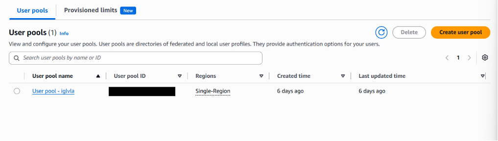 | 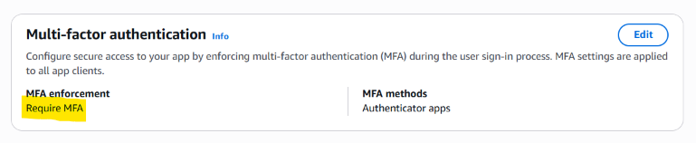 |
| Cognito User Pool | MFA Required |
| 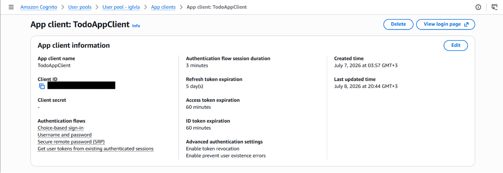 | 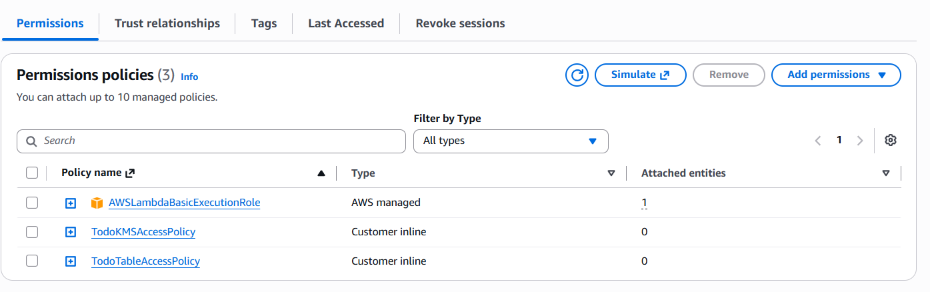 |
| App Client | IAM Execution Role |
| 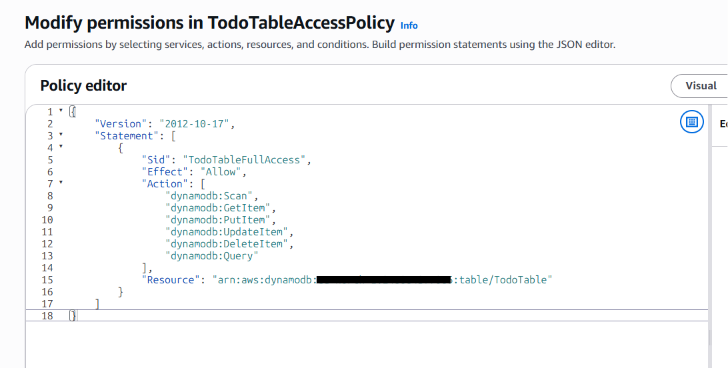 | |
| Least-Privilege IAM Policy | |

---

## Data Layer

| | |
|---|---|
| 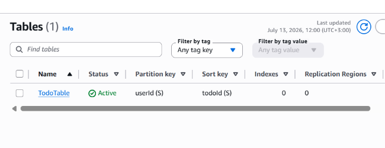 | 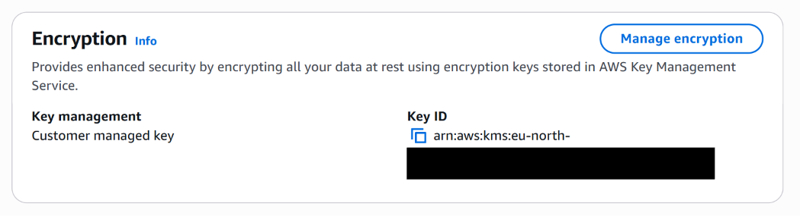 |
| DynamoDB Table | Customer-managed KMS |
| 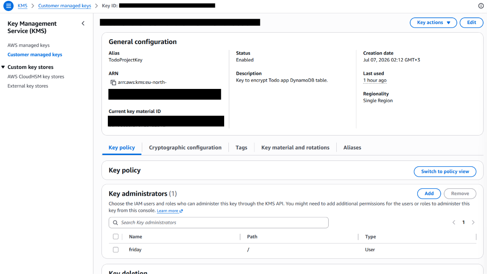 | 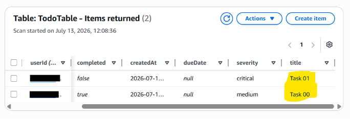 |
| KMS Key | Sample Records |

---

## Compute

| | |
|---|---|
| 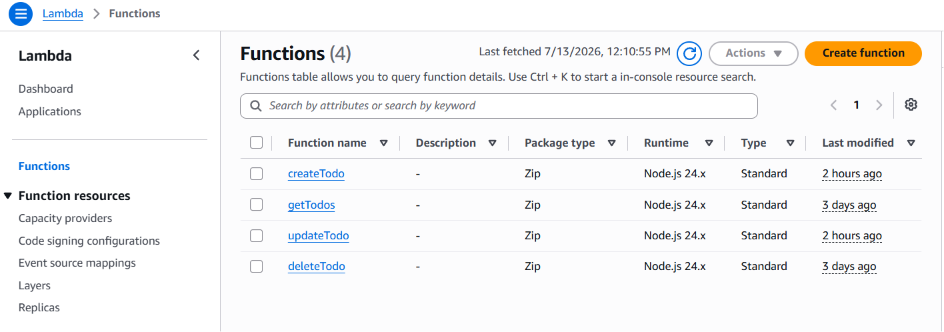 | 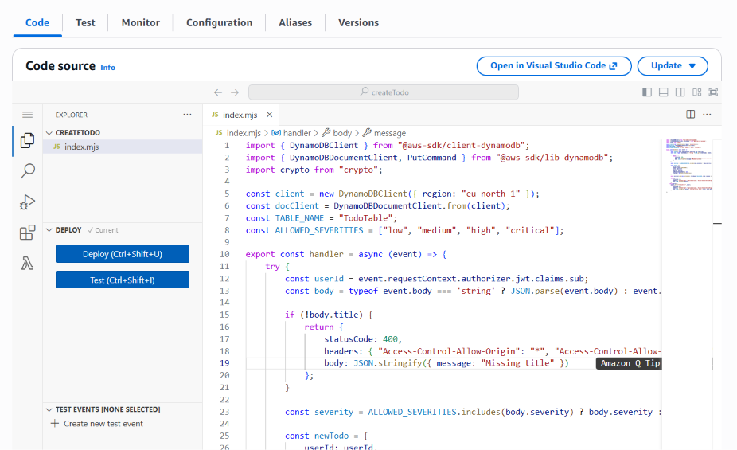 |
| Lambda Functions | Source Code |
| 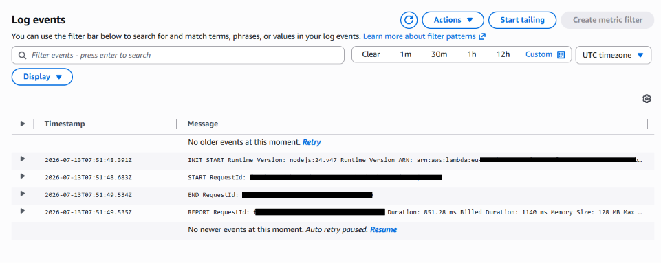 | |
| Successful Invocation | |

---

## API Gateway

| | |
|---|---|
| 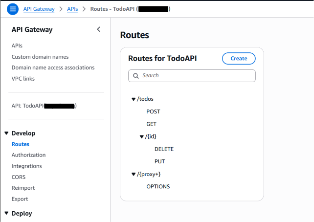 | 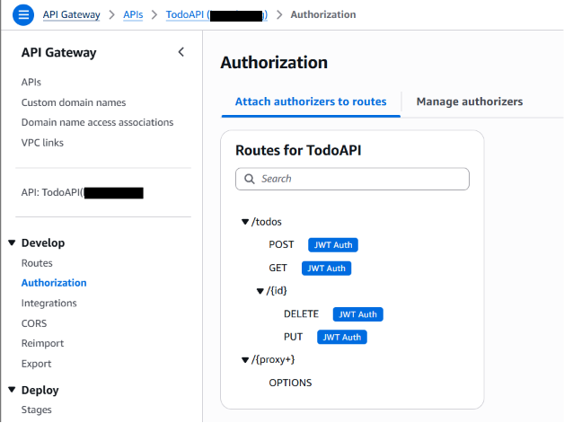 |
| REST Routes | JWT Authorizer |
| 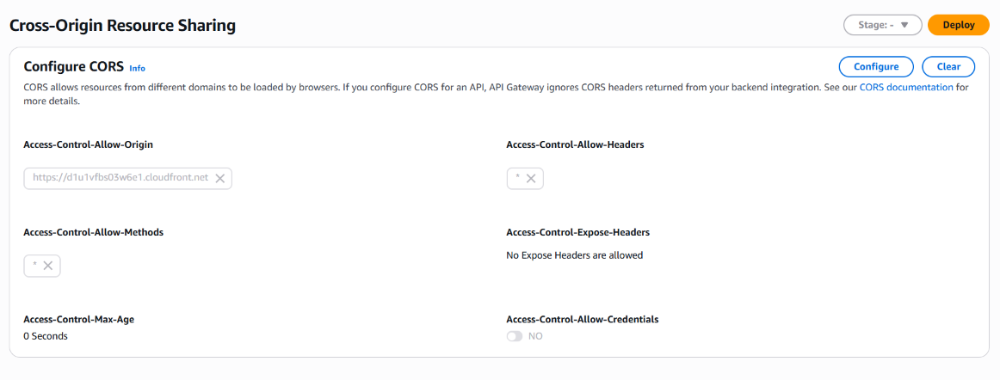 | |
| Secure CORS | |

---

## Edge Security

| | |
|---|---|
| 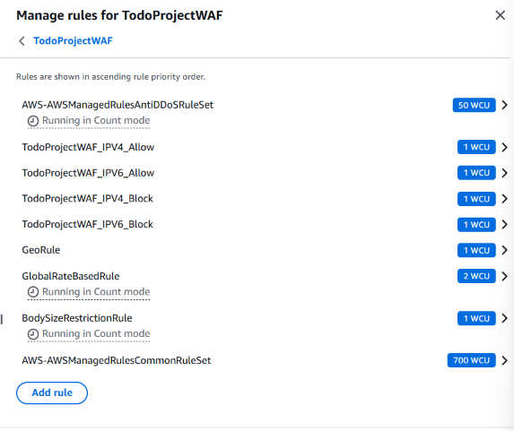 | 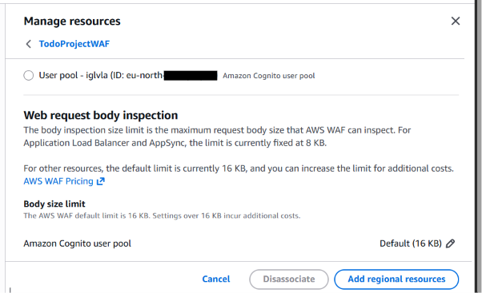 |
| Web ACL | Associated Resources |
| 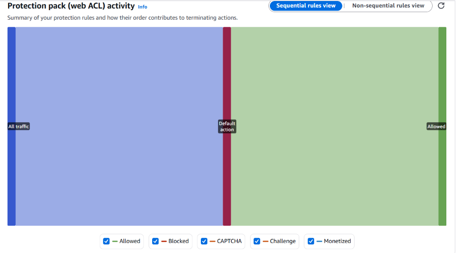 | |
| WAF Metrics | |

---

## Frontend Hosting

| | |
|---|---|
| 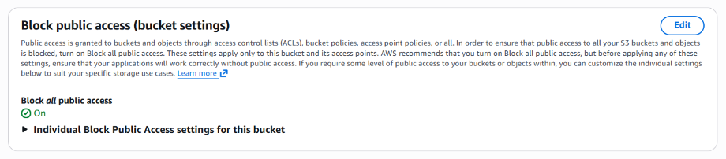 | 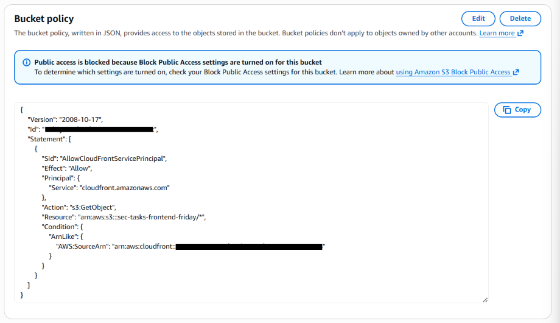 |
| Block Public Access | Bucket Policy |
| 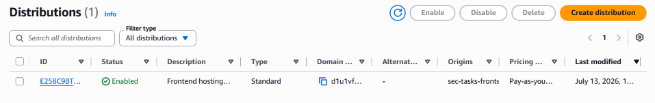 | 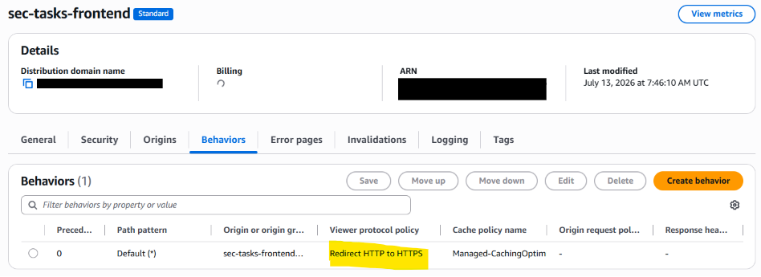 |
| CloudFront | HTTPS Redirect |

---

## Application

| | |
|---|---|
| 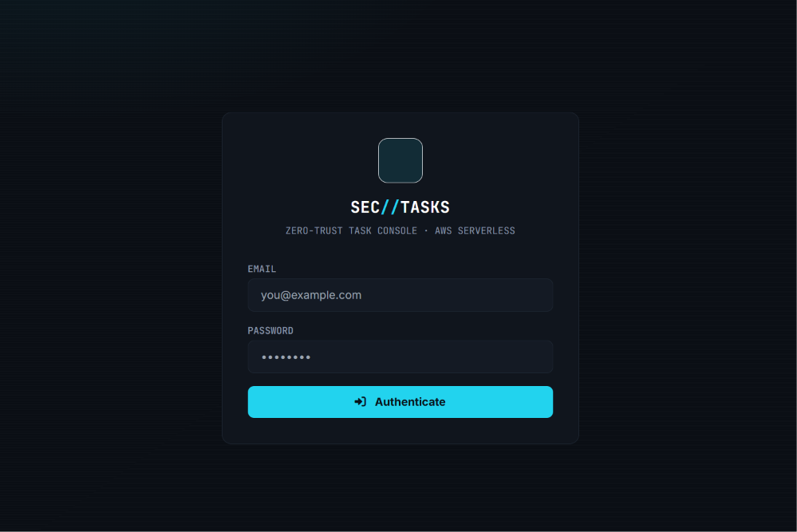 |  |
| Login Screen | Security Dashboard |
| 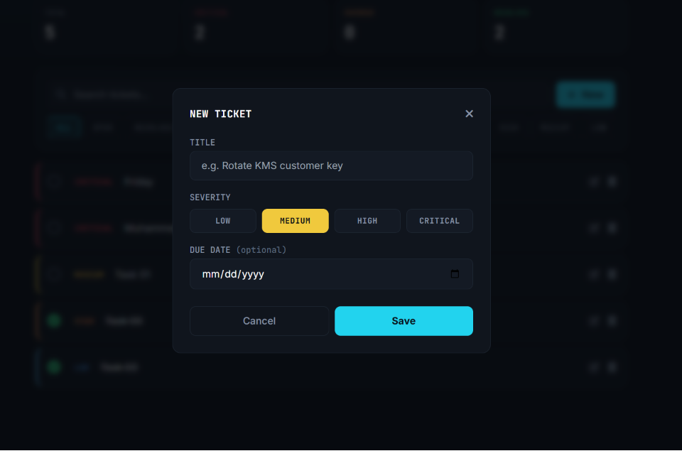 | 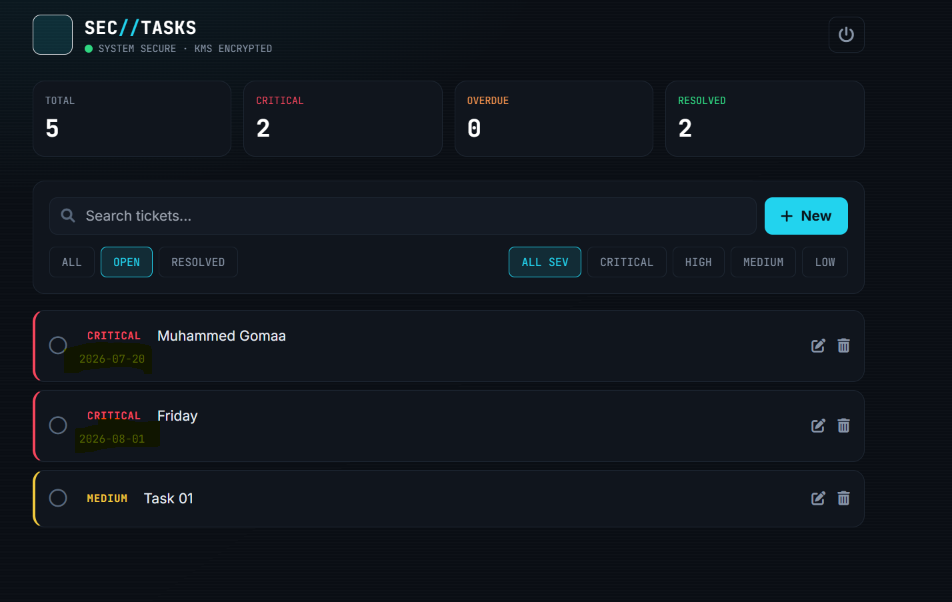 |
| Create / Edit Task | Filtering & Search |

---

## Security Validation

| | |
|---|---|
| 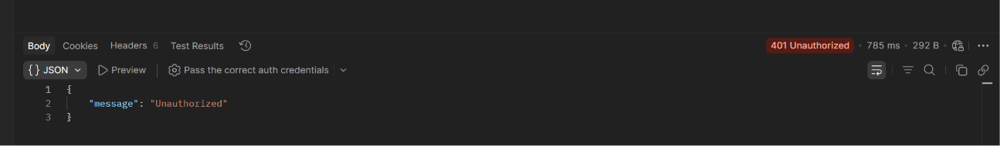 |  |
| Unauthorized Request | Successful Authenticated Request |
| 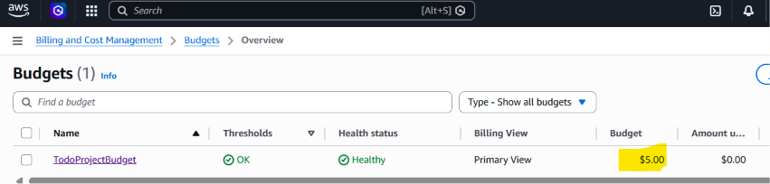 | |
| AWS Budget Alert | |

---

# 🧩 Challenges & Troubleshooting

Real-world cloud deployments rarely succeed on the first attempt.

Troubleshooting infrastructure, permissions, and integrations became one of the most valuable parts of this project.

---

## 1. DynamoDB Table Name Mismatch

### Problem

Lambda functions referenced an incorrect DynamoDB table.

Result:

```
ResourceNotFoundException
```

---

### Root Cause

The deployed table name differed from the hardcoded constant.

---

### Resolution

Updated the shared table configuration across every Lambda function.

---

## 2. IAM Permission Issues

### Problem

Create and Delete operations failed.

```
AccessDeniedException
```

---

### Root Cause

The IAM execution role lacked several DynamoDB actions.

---

### Resolution

Updated the Least-Privilege IAM Policy to include the required permissions while keeping resource scope restricted to the target table.

---

## 3. ES Modules Migration

### Problem

Node.js 24 executed Lambda functions as ES Modules while some code still used CommonJS syntax.

```
ReferenceError:
require is not defined
```

---

### Resolution

Migrated every Lambda function to:

```javascript
import
export
```

using the `.mjs` runtime.

---

## 4. Local Development & CORS

### Problem

Opening the frontend directly using:

```
file://
```

caused browsers to reject API requests.

---

### Root Cause

Browser CORS restrictions.

---

### Resolution

Served the application through a local HTTP server during development before locking production CORS to the CloudFront domain.

---

## 5. JWT Integration

### Challenge

Ensuring that user identity could never be spoofed by clients.

---

### Solution

The backend ignores any client-provided user identifier and instead extracts ownership directly from the verified JWT claims issued by Amazon Cognito.

This completely eliminated an entire class of authorization vulnerabilities.

---

## 6. CloudFront + Private S3

### Challenge

Serving a static website while keeping the S3 bucket completely private.

---

### Solution

Configured:

- Block Public Access
- Origin Access Control (OAC)
- Bucket Policy scoped only to CloudFront

Result:

The website is publicly accessible while the storage bucket itself remains inaccessible from the Internet.

# 📚 Lessons Learned

Building SEC//TASKS provided much more than experience with AWS services—it reinforced practical cloud engineering and security concepts that are difficult to learn from documentation alone.

Throughout the project, I gained hands-on experience in designing, deploying, troubleshooting, and securing a production-inspired serverless application.

Key takeaways include:

- Designing security-first cloud architectures rather than adding security afterward.
- Applying Zero Trust principles to every request.
- Implementing least-privilege IAM policies instead of broad administrative permissions.
- Understanding the complete JWT authentication lifecycle using Amazon Cognito.
- Building secure REST APIs protected by API Gateway Authorizers.
- Using customer-managed KMS keys to control encryption policies.
- Protecting public APIs using AWS WAF.
- Hosting static websites securely with private S3 buckets and Origin Access Control.
- Diagnosing real infrastructure issues using CloudWatch Logs.
- Understanding how managed AWS services integrate to build scalable systems.

More importantly, the project demonstrated that cloud security engineering is not about configuring isolated AWS services—it is about designing multiple independent security layers that work together.

---

# 🚀 Future Roadmap

Although the application is production-inspired, several improvements are planned for future iterations.

## Infrastructure

- [ ] Migrate the entire infrastructure to AWS SAM or CloudFormation.
- [ ] Introduce reusable Infrastructure-as-Code modules.
- [ ] Parameterize deployments for multiple environments.

---

## DevSecOps

- [ ] Build a complete CI/CD pipeline using GitHub Actions.
- [ ] Automate Lambda deployments.
- [ ] Automate frontend deployment to S3 & CloudFront.
- [ ] Implement automatic CloudFront cache invalidation.
- [ ] Add deployment approval workflows.

---

## Security

- [ ] Attach an additional WAF Web ACL directly to CloudFront.
- [ ] Integrate Amazon GuardDuty.
- [ ] Enable AWS Config compliance monitoring.
- [ ] Integrate Amazon Inspector where applicable.
- [ ] Add CloudTrail auditing documentation.
- [ ] Implement Secrets Manager for future sensitive configuration.
- [ ] Introduce AWS Shield Advanced (production scenario).

---

## Monitoring & Operations

- [ ] Create CloudWatch Dashboards.
- [ ] Add CloudWatch Alarms.
- [ ] Integrate SNS notifications.
- [ ] Implement structured application logging.
- [ ] Add operational health metrics.

---

## Backend

- [ ] Infrastructure unit testing.
- [ ] Lambda integration tests.
- [ ] API contract testing.
- [ ] Request validation middleware.
- [ ] Better error handling.
- [ ] Pagination support.
- [ ] Batch operations.

---

## Frontend

- [ ] Dark / Light theme support.
- [ ] Dashboard analytics.
- [ ] Better mobile responsiveness.
- [ ] Real-time notifications.
- [ ] Advanced filtering.
- [ ] Export tasks.
- [ ] Better accessibility.

---

## Architecture

- [ ] Introduce EventBridge.
- [ ] DynamoDB Streams.
- [ ] SNS notifications.
- [ ] SQS asynchronous processing.
- [ ] Step Functions workflows.

---

# 💡 Skills Demonstrated

This project demonstrates practical experience with modern cloud architecture and AWS security engineering.

## Cloud

- Amazon Web Services (AWS)
- Serverless Computing
- Event-Driven Architecture
- Cloud Architecture
- Cloud Security

---

## Identity & Access Management

- Amazon Cognito
- JWT Authentication
- Multi-Factor Authentication (MFA)
- Identity Federation Concepts
- Least-Privilege IAM
- Role-Based Access

---

## Security

- Zero Trust
- Defense in Depth
- Security by Design
- OWASP Awareness
- API Security
- Data Protection
- Encryption at Rest
- Customer-managed KMS Keys
- Web Application Firewall
- Rate Limiting
- Secure CORS Configuration
- Private Cloud Storage
- IDOR Prevention

---

## AWS Services

- AWS Lambda
- Amazon API Gateway
- Amazon DynamoDB
- Amazon Cognito
- AWS IAM
- AWS KMS
- AWS WAF
- Amazon CloudFront
- Amazon S3
- Amazon CloudWatch
- AWS Budgets

---

## Backend

- REST APIs
- Node.js
- ES Modules
- JavaScript (ES6+)
- CRUD Operations
- Stateless Architecture
- Secure API Design

---

## Frontend

- HTML5
- Tailwind CSS
- Vanilla JavaScript
- Responsive UI
- Fetch API

---

## DevOps & Operations

- Cloud Deployment
- Infrastructure Troubleshooting
- Logging & Monitoring
- Root Cause Analysis
- AWS Console Operations

---

# 📖 Key Security Concepts Demonstrated

| Security Principle | Implementation |
|--------------------|----------------|
| Zero Trust | Every API request requires verified identity |
| Defense in Depth | Multiple independent security layers |
| Least Privilege | IAM policies scoped to minimum permissions |
| Authentication | Amazon Cognito + MFA |
| Authorization | JWT Authorizer |
| Encryption | Customer-managed AWS KMS |
| Availability | Fully managed AWS services |
| Monitoring | CloudWatch |
| Edge Protection | AWS WAF |
| Secure Storage | Private S3 + Origin Access Control |

---

# 🎯 Project Highlights

✔ Fully Serverless Architecture

✔ Zero Trust Security Model

✔ Production-inspired AWS Deployment

✔ Defense-in-Depth Security

✔ Least-Privilege IAM

✔ Customer-managed Encryption

✔ JWT Authentication

✔ Mandatory MFA

✔ Private Static Website Hosting

✔ AWS WAF Protection

✔ Secure REST API

✔ CloudWatch Monitoring

✔ Cost Guardrails

✔ End-to-End HTTPS

✔ Modern Security Operations Dashboard

---


# 👨‍💻 Author

## Muhammed Mustafa Gomaa

**Network Security Engineer**

